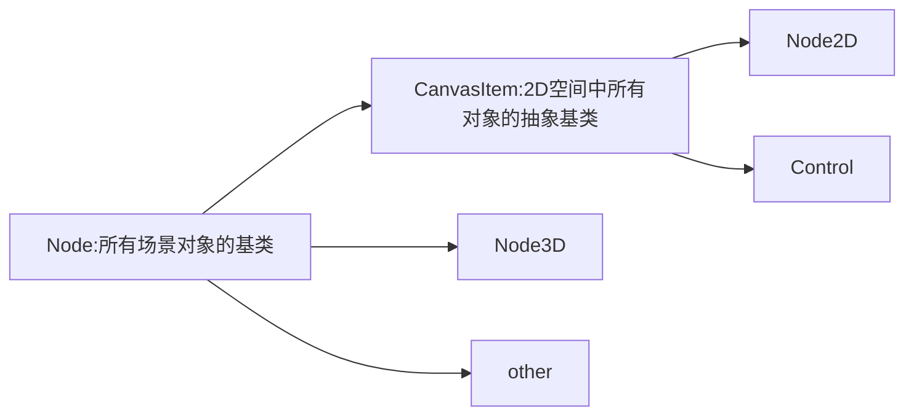
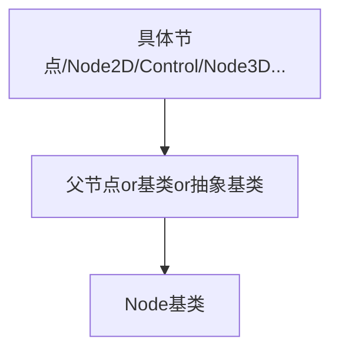
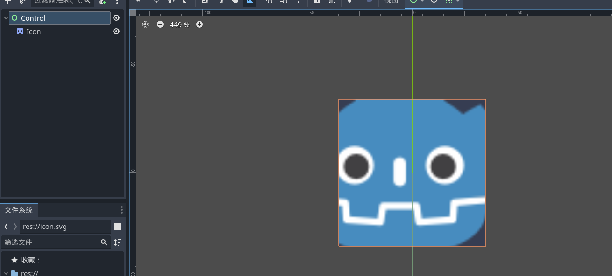
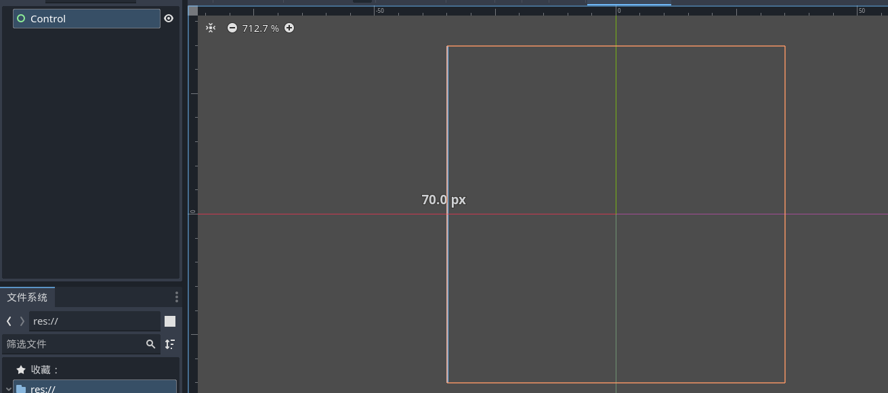
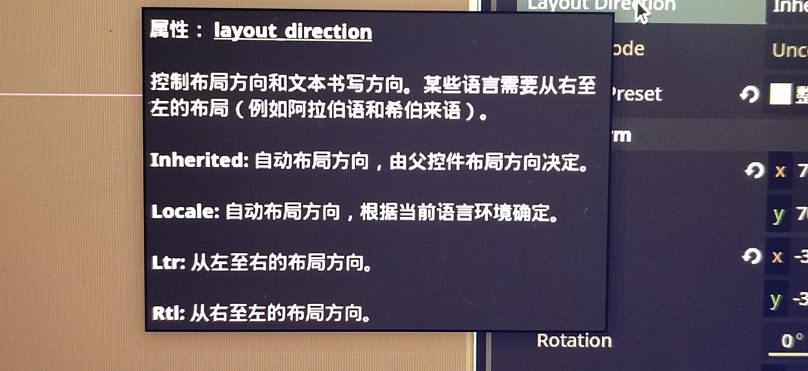
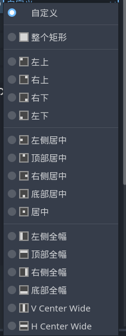
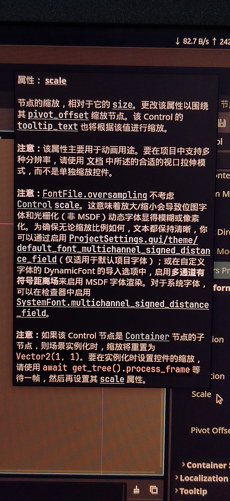
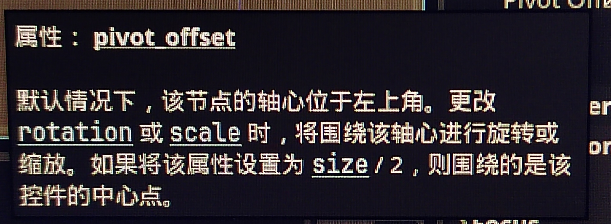

# godot游戏开发

1. 标题

2. ==节点类型==

3. {}：下划线

4. []：下划线

5. ()：双下划线

6. 属性 ##数据

   ##因为数据可以可以出现{},[],()中素以6号不一定非要在5号中，而是3号，4号，5号中都可以。

## ！！检测器里面，不同节点，是基于



的顺序：==从上向下==分别是




## ==Control_node==检测器

### **Control : ** 所有GUI控件的基类。根据其父控件调整位置和大小。

#### <u>Layout :</u> 布局

###### 	Clip Contents: 剪辑内容



###### 	Custom Minimum Size: 自定义最小尺寸



###### 	Layout Direction: 布局方向



###### 	Layout Mode: 布局模式

###### 	Anchors Preset: 锚点预设



##### 		<u>Transform:</u> 变换

###### 			Size: 大小

###### 			Position: 位置

###### 			Rotation: 旋转

###### 			Scale: 尺寸**缩放**



###### 			Pivot Offiset: 枢轴偏移



##### **Container Sizing:** 容器尺寸

###### Horizontal: 水平方向

###### Vertical: 垂直方向

###### Stretch Ratio: 拉伸比

#### Localization : 本地化

###### Auto Translate: 自动翻译

###### Localize Numeral System: 本地化数字系统

#### Tooltip : 工具提示

###### Text: 默认工具提示文字

#### Focus : 聚焦

###### Neighbor Left:左边的节点

###### Neighbot Top:上边的按钮

###### Neighbot Right:右边的按钮

###### Neighbot Bottom:下边的

###### Next:下一个

###### Previous:

###### Mode:

> None:
>
> Click:
>
> All

#### Mouse : 鼠标

###### Filter:滤波器

> Stop:
>
> Pass:
>
> Ignore:

###### Force Pass Scroll Events:强制传递滚动事件

###### Default Cursor Shape:默认光标形状

#### Input : 输入

###### Shortcut Context:快捷方式上下文

#### Theme : 主题

###### Theme:主题

###### Type Varlation:类型变化

### **CanvasItem:** 2D空间中所有对象的抽象基类

#### Visibility:可见性

###### Visble:

###### Modulate:

###### Self Modulate:

###### Show Behind Parent:

###### Top Level:

###### Clip Children:

###### Light Mask:

###### Visbility Layer:

#### Ordering:排序

###### Z Index:

###### Z as Relative:

###### Y Sort Enabled:

#### Texture:纹理

###### Filter:

###### Repeat:

#### Material:材质

###### Material:

###### Use Parent Material：

### **node:** 所有场景对象的基类

#### Process:

###### Mode:

###### Priority:

###### Physics Priority:

##### Thread Group:

###### Group:

#### Editor Description:

###### Description:

#### **script:**

#### **添加元素:**


---

---

## GDscript

### 数字

数字是任何计算机程序中的重要数据类型。GDScript 支持整数和浮点值。这两种类型都可能是阳性或阴性的。

我们可以为变量分配数字。然后，该值可能会被传递和更改。如果不应更改该值很重要，则应将其分配给常量。

以下是一些编号分配示例。注释以 # 字符开头。

```gdscript
# Integers
var a = 1
var b = -23
var c = 0
var d = 0xA1Fe316 # hexadecimal

# Floats
var x = 1.0
var y = -43.01
var z = 1.3e6

# Constant
const THE_ANSWER = 42
```

预定义常量包括：PI、TAU、INF（无穷大）

对于练习，请编写代码以将数字打印到编辑器的“输出”窗口。

可以玩的想法：

- 如果尝试更改常量的值，会发生什么情况？
- 尝试输入指数为 3e6（300 万）的浮点值
- 如果你输入疯狂的大数字会怎样？
- 十六进制数字使用什么大小写重要吗？
- 使用内置常量查看其输出值

下面是一个代码模板，用于入门：

```gdscript
extends Node2D

const SPEED = 75
var number = SPEED

# Called when the node enters the scene tree for the first time.
func _ready():
	# Print the value to the Output window of the editor
	print(number)
	number = 86
	print(number)
```

#### 枚举

*枚举*对于定义几个相关的常量很有用，在这些常量中，您不关心引擎自动分配的值，例如`enum {COLD, WARM, HOT}`

#### 有关计算机上存储的数字的更多信息

计算机芯片将数据存储为二进制的 1 和 0 序列。每个值都是一个位。整数存储为 64 位。这限制了整数值的范围。

如果你继续将 1 添加到整数中，它将达到最大正值（63 个 1），然后，再加一个 1 将翻转符号位（第 64 位），因为所有前面的 1 都会携带新的 1（在二进制算术中），给出最大负值。然后我们开始向零倒数，并再次数到最大正值。

所以这个数字环绕了。您认为这比出现停止（崩溃）溢出错误要好吗？

#### 数字换行

在游戏中，用数字环绕可能很有用。例如，沿重复地形的位置坐标。也许地形 x 坐标被映射为整数，并且地形高度在您沿它移动时作为 x 的函数上下绘制？

但是您可能希望您的战士在游戏持续期间穿越地形。因此，如果 x 是一个环绕的整数，则无需担心在电子竞技锦标赛的最后阶段达到 x 的最大值时会发生错误。

#### 整数

整数非常适合需要整数的计数器、索引值和 ID 号。即使是最流行的多人游戏也不太可能用完使用整数的玩家的唯一 ID 号。是的，但要小心机器人！

#### 浮点数

浮点数被大量用于其他任何事物，例如数量、角度、长度等。对于精确比较来说，它们不如整数那么好，例如因为需要考虑精度误差。例如：0.0001 看起来足够接近零，但在代码中实际上大于零。`A equals zero`

#### 结论

在计算和赋值中混合数字时，当数字类型发生更改时，将进行强制转换。除非我们采取预防措施，否则这可能会导致意想不到的结果。期待在以后的教程中探索这个有趣的主题。

---

### 变量

在所有编程语言中，变量都用于存储值和引用。例如：当前分数值或对库存项的引用。

最好在小写文本中为变量提供描述性名称，并用下划线连接单词。以下是变量声明的一些示例：

```gdscript
var score = 0
var remaining_fuel = 99.9
vA equals zeroar paused = false
var player_name = ""
var selected_weapon
var starting_grid_position
```

请注意，有些变量还没有设置值，我们可以为变量分配不同类型的值。

一些基本**类型**如下：

| 类型   | 详                     | 例子        |
| ------ | ---------------------- | ----------- |
| int    | 一个 64 位有符号的号码 | -12 54 0xAF |
| 浮     | 浮点数                 | 1.23 1e6    |
| 布尔值 | 对或错                 | 真 假       |
| 字符串 | 对于单词和字符序列     | “你好世界”  |

#### 变量

在我们的第一个示例中，变量可以采用任何类型的值，并且该值稍后可能会更改为另一种类型的值。这种变量称为 Variant。

因此，以这种方式对变量声明进行编码既简单又快捷。

#### 类型化变量

有一种方法可以声明变量将接受的值*类型*。这样做的好处是可以减少错误，并在输入代码时从编辑器获得帮助和警告。

有两种方法可以声明类型化变量，如下所示：

```gdscript
# Method 1
var score: int = 0
var remaining_fuel: float = 99.9
var paused: bool = false
var player_name: String = ""

# Method 2 (inferring the type)
var my_int := 8
var size := 32.6
var running := true
var name := ""
```

我们称之为*静态*类型，当像以前一样使用变体时，我们称之为*动态类型*。两者都可以在您的程序中随心所欲地使用。

#### 可变范围

作用域是程序代码中可以访问变量的区域。文本缩进级别用于在编辑器中定义范围，并且可以展开和折叠各个区域。

全局范围是变量在任何地方都可用的地方，例如在自动加载文件中声明变量时。局部作用域是函数中包含声明后变量的区域。

最好将变量的范围保持在尽可能小的范围内，以减少错误并创建不依赖于外部变量的独立功能块。

下面是*全局*和*局部*范围的示例：

```gdscript
extends Node2D

# score has global scope in this code module
var score = 5

# A function that may be called to add points to score
func add_to_score(points):
	# points is a variable passed from outside
	# it has local scope in this indented code block
	score = score + points

# 
func _ready():
	add_to_score(1)
	# score is accessible inside this code block
	print(score) # prints 6
```

如果您依赖于全局作用域，并错误地在局部作用域中重新声明了具有相同名称的变量，则 Bug 可能会蔓延。如以下示例所示：

```gdscript
extends Node2D

var score = 5
var new_score

func add_to_score(points):
	# new_score is accidentally re-declared
	# with local scope in this indented code block
	var new_score = score + points

func _ready():
	add_to_score(1)
	# new_score has not been set
	print(new_score) # prints null
```

对于练习，练习声明静态和动态类型的变量。打印出值，并尝试范围以巩固您对概念的理解。

---

### 运算符

这些主要用于二进制位的计算、比较和操作。

它们按重要性（优先级）的顺序进行评估。

例如，在计算中：乘以 （x） 优先于加 （+），因此 2 + 3 x 2 等于 8 而不是 10。一个好的计算器应该遵守这个优先规则。要进行练习：在您的智能手机计算器应用程序上查看。

下表首先列出了具有最高优先级的运算符。

#### 数学运算符

| 算子  | 描述               |
| ----- | ------------------ |
| -x    | 否定               |
| * / % | 倍数 / 除数 / 余数 |
| +     | 加                 |
| -     | 减去               |

余数应用于整数，工作原理如下：5 % 2 等于 1，因为 5 除以 2 等于 2 余数 1。

此运算符（也称为模运算符）的一个很好的用途是限制计数器值的范围。如果除数为 n，则计数器将在 0 和 n - 1 之间计数，并在 n 的每个倍数上回滚到*零。*

一些分配快捷方式可用，如下所示（这些快捷方式的优先级低于任何内容 - 您可能会假设，因为它们接受先前评估的结果）：

| 例     | 等效操作  |
| ------ | --------- |
| x += 1 | x = x + 1 |
| x -= 1 | x = x - 1 |
| x *= 2 | x = x * 2 |
| x /= 2 | x = x / 2 |
| x %= 3 | x = x % 3 |

#### 布尔运算符

这些是主要在 *if* 语句中使用的比较运算符和逻辑运算符。

| 运营商          | 描述       |
| --------------- | ---------- |
| < == > != >= <= | 比较运算符 |
| !不             | 不         |
| && 和           | 和         |
| \|\|或          | 或         |

一个常见的错别字错误是只输入一个等号，表示*分配*而不是*比较*，但编辑器会检测到这一点并向您发出警告。

布尔运算的结果是 *true* 或 *false*。

示例：x = 3 > 4 或 5 < 6 # x == true

#### 按位运算符

注意：*按位运算符不太可能经常使用，除非您正在做一些涉及位操作的技术性很强的事情*。

每个数字或字符都由二进制位组成，因此我们能够翻转位、移位、屏蔽位等。单个位是 0 和 1。它们根据与数字逻辑门工作方式相关的逻辑运算进行设置或复位。

第一位称为 LSB（最低有效位），最后一位称为 MSB（最高有效位）。由零位或一位构成的数字是二进制数。

二进制计数是这样的：0 1 10 11 100 101 110 111 1000 ...

但是，在编辑器中，我们只能看到十进制等效数字。因此，您需要想象 8 的二进制等价物是 1000。

练习：使用 Windows 中的程序员计算器（或操作系统中的等效应用程序）来习惯于使用二进制数来糊弄。

| 算子   | 描述                                                    |
| ------ | ------------------------------------------------------- |
| ~      | NOT（反转位）                                           |
| << >>  | 将左侧操作数的位向左或向右移动 n 个位置 （1 << 2 == 4） |
| &      | 两个值的逻辑 AND                                        |
| ^      | 两个值的逻辑异或                                        |
| \|     | 两个值的逻辑 OR                                         |
| &= \|= | 作业快捷方式                                            |

#### 短路评估

包含逻辑运算符的表达式按从左到右的顺序计算。这意味着，只要条件必须为真或假，就不需要计算表达式的其余部分。这使得评估速度更快。

有了这些知识，我们可以对表达式的各个部分进行排序，以便将最重要或最快的部分放在左边。

例如：引用对象的变量可能是 null，在逻辑表达式中计算结果为 false，但如果我们尝试运行该对象的方法，则会导致错误。

以下是一些示例：

```gdscript
func _ready():
    var x = 4
    var y = 6
    if x < y or x > 0: # Only x < y needs to be evaluated here
        print("ok")
    var label = Label.new()
    # Here we ensure that label exists before evaluating
    # the right side of the expression.
    if label and label.text == "":
        label.text = "Hello"
```

#### 总结

我们按有用性顺序介绍了数学运算符、布尔运算符和按位运算符，因此理解的重要性。一些 GDScript 运算符已被排除在本节之外，因为它们是稍后将要介绍的更高级主题的一部分，因此请在后面的教程中期待它们！

---

### 功能

函数是一种将执行*相关操作*的代码部分组合在一起的方法。它们帮助我们编写更具*可读性的*代码，并避免在多个地方重复相同的代码。

平方根函数可能很熟悉。它有一个输入并返回一个输出。函数可以有零个或多个输入，并可以选择返回结果。

函数始终属于一个类，*该类*是*相关函数*的容器。因此，当你在 Godot 中*扩展*一个节点时，你正在创建一个包含你的函数和变量的类。

扩展类还将继承它扩展的类的函数和*属性*。属性是在类的最顶层作用域中声明*的成员变量*。

#### 代码入口点

继承的函数之一是 **_ready 函数**。这是由引擎为进入*场景树*的每个*节点*调用的。我们能够*覆盖*此函数，以便让它运行我们的初始化代码。

我们可以覆盖的另一个*继承函数*是 **_process（delta）** 函数。引擎会为每*一帧*视频调用此函数。*增量*输入值是自上一帧以来经过的时间。在此函数中，我们可以插入驱动游戏活动的代码。

这些*内置函数*的名称中带有下划线前缀。对于我们的自定义函数，我们可能会以与变量相同的方式命名它们。

如果你想知道“我的代码的入口点在哪里？”，那么你可以看到它是通过我们可以覆盖的内置函数。引擎在*初始化*、*输入事件*和*遍历游戏循环*时调用它们。

以下是我们如何开始开发游戏代码：

```gdscript
extends Node2D

# Declare member variables here.
var player
var enemies
var score

# Called when the node enters the scene tree for the first time.
func _ready():
	add_enemies()
	get_player_details()

func add_enemies():
	pass # Add code to do this later

func get_player_details():
	pass # Add the code later

# Called every frame.
func _process(delta):
	process_inputs(delta)
	process_enemy_activity(delta)
	update_score()

func process_inputs(delta):
	pass

func process_enemy_activity(delta):
	pass

func update_score():
	pass
```

我们在这里使用了*声明式编程*方法，其中我们描述了我们想要做什么（使用函数名称），但我们还不知道什么代码将实现它。

#### 函数输入

函数的输入称为*参数*。可能没有参数、参数列表、类型指定的参数和具有默认值的参数。

#### 函数返回值

*return* 关键字用于在任何时候返回。这意味着无论是否使用值（返回 *null* 值）退出函数，直到程序代码中调用函数的位置之后的点。

如果未使用 *return* 关键字，则代码将运行到函数末尾并返回 *null* 值。

不必使用返回值，只需调用函数而不捕获其返回值即可。但是，如果该值不*为 null*，这可能会在错误窗口中生成警告，以提醒您注意代码逻辑中的潜在 bug。

此外，可以指定返回*类型*以增加额外的 bug 抵抗力。

以下是在工作示例脚本中定义函数的方法示例：

```gdscript
extends Node2D

# Called when the node enters the scene tree for the first time.
func _ready():
	add(5, 6) # Prints 11 to Output window
	var sum = get_sum(2, 4) # Sets sum to 6
	var my_int = add_ints(sum, 4) # Sets my_int to 10
	my_int = times_2(my_int) # sets my_int to 20
	move_x(self, my_int) # Move this node 20 pixels along x axis
	move_x(self) # Move by the default value

# This function has no return value
func add(a, b):
	print(a + b)

# This function returns a value
func get_sum(a, b):
	return a + b

# This function will only accept integer arguments
func add_ints(a: int, b: int):
	return a + b

# Generate an error if the return value is not an int
func times_2(n) -> int:
	return 2 * n

# This function modifies an object that is passed by reference
func move_x(node: Node2D, dx = 1.5):
	node.position.x += dx
```

在上面的代码中，您可以看到节点的属性被更改，而没有返回节点值。这之所以有效，是因为节点值是对象的引用编号，并且该对象被称为*通过引用传递*的。与此形成鲜明对比的是*按值传递*的简单数字，其中它具有函数*的本地范围*，需要返回以使用新值。

#### 习题

修改通过引用传递的对象并返回值怎么样？当我们返回一个布尔值来指示我们对对象的操作是成功还是失败时，这可能很有用。作为练习，请尝试自己将其作为示例添加到上述代码中。

#### 笔记

函数内的所有内容都必须完成，下一帧才能出现在屏幕上（除非你使用 yield，这会把你的函数变成协程）。图片来源：[Lars Kokemohr](https://www.facebook.com/lars.kokemohr)

下一个主题是关于[条件语句](https://gdscript.com/tutorials/conditional-statements/)的，我们将开始研究如何实现产生结果的代码，所以请期待。

---

### 条件语句

条件语句允许我们控制程序执行的流程。如果代码语句只一个接一个地执行，直到函数结束，则功能将非常有限。

曾几何时，流程图很流行（也许它们现在仍然很流行？），我们可以用决策节点设计我们的程序流程，以决定要关闭哪个分支。通常，我们会测试一个条件的真假，并相应地分支。

在游戏中，我们可能有简单的*真/假*条件来测试，或者，一个具有多种可能性的更复杂的状态。

基本条件语句使用 if / *else / elif* 语法。我们使用缩进来定义 if 结构的深度级别。下面是一些 GDScript 代码示例：

```gdscript
extends Node2D

func _ready():
	var n = 6
	
	# Inline 'if' statement
	if n == 6: print("n is equal to six")
	
	n = 4
	# Regular 'if' statement 
	if n == 4:
		print("n is equal to four")
	
	# 'else/if' statement
	if n == 6:
		print("n is equal to six")
	else:
		print("n is not equal to six")
	
	# Messy indented 'else/if' statement
	if n == 6:
		print("n is equal to six")
	else:
		if n < 6:
			print("n is less than six")
		else:
			print("n is greater than six")
	
	n = 8
	# Tidier 'else/if' statement using 'elif'
	if n == 6:
		print("n is equal to six")
	elif n < 6:
		print("n is less than six")
	else:
        print("n is greater than six")
```

在上面的代码中，您可以看到缩进在有多个 *if* test 的情况下会变得混乱，因此可以使用 *elif* 使代码更整洁。

#### 匹配语句

在其他编程语言中，通常提供 switch 语句以允许基于测试值的多个情况进行条件分支。GDScript 提供了一个强大的替代 [Match](https://docs.godotengine.org/en/stable/getting_started/scripting/gdscript/gdscript_basics.html#match) 语句。

这在官方文档中得到了很好的解释，所以请点击上面的链接来了解它。

我们的游戏状态可能处于多种状态之一，这些状态可以通过 Match 语句进行评估，以决定需要执行哪些代码来处理当前游戏。

#### 三元中频表达式

这是一个方便的单行代码，用于根据条件为变量赋值。

```
var x = [value] if [expression] else [value]
```

代码示例：

```gdscript
var paid = false
var strength = 9.9 if paid else 1.0
print("Strength = ", strength)
```

下一个主题是 [GDScript 循环](https://gdscript.com/tutorials/looping/)

---

### GDScript 循环

GDScript 中的循环是通过 *for* 循环或 *while* 循环完成的。

#### For 循环

for 循环从一系列数字中设置索引值，或者通过遍历对象（如*数组*或*字典*）来设置索引值。

range 函数让我们定义一个整数范围。起始编号默认为 0。限制数比最大计数多 1，因为传统上是这样完成的，因为索引值往往从零而不是 1 开始。

我们还可以指定一个正或负步长值，默认值为 1。

*for* 循环的语句主体是缩进的。

您可以随时使用 *break* 语句终止循环。这可用于打破用于在集合或文本文档中搜索项的循环。

要跳到语句块的末尾，我们可以使用 *continue* 语句。

下面是一些代码示例，显示了实现 for 循环的各种方法：

```gdscript
# loop for n = 0 to 7
for n in 8:
    print(n)

# Using range
for n in range(8):
    print(n)

# loop for n = 10 to 12
for n in range(10,13):
    print(n)

# count down from 10 to 1
for n in range(10,0,-1):
    print(n)

# loop for n = 2,4,6,8 in steps of 2
for n in range(2,9,2):
    print(n)

# Iterate over string (array of characters)
for ch in "Hello":
    print(ch)

# Iterate over an array of numbers
for x in [3,6,8,9]:
    print(x)

# Iterate over items of a dictionary
var dict = { "x": 1, "y": 2, "z": 3 }
for key in dict:
    # Insert the key and value into a text string
    print("index: %s, value: %d" % [key, dict[key]])

# Using continue and break statements
for n in 9:
    # Skip numbers below 3
    if n < 3:
        continue
    # Break out of the loop for numbers above 5
    if n > 5:
        break
    print(n)
```

#### While 循环

*while* 循环计算布尔表达式，以决定是继续循环还是退出循环。同样，我们可以用 *break* 语句打破循环，或者用 *continue* 语句跳到语句块的末尾。

下面是一些示例代码：

```gdscript
var fuel = 1000
var speed = 0

while fuel > 0:
    speed += 0.12
    fuel -= 1

print("Top speed = ", speed)
```

接下来，我们将了解 [GDScript 数组](https://gdscript.com/tutorials/arrays/)。

---

### 数组

数组用于存储各种元素的列表，例如数字或对象。大多数情况下，它们是一维的，但可能是多维的，用于存储与网格或 3D 空间相关的数据。

*数组*的每个元素都由第一个元素从零开始的整数索引值引用。

数组是一个对象，具有各种可用的辅助函数来使用它，例如附加新值、获取*数组*的大小、对值进行排序和对值进行洗牌等。

由于它是一个对象，因此它通过引用传递到函数中，因此在函数调用中对其*元素*所做的更改将直接传递给其*引用*传递给函数的数组*对象*。

这些代码示例将帮助您了解如何使用 GDScript 数组：

```gdscript
extends Node2D

func _ready():
	# Ways to create an array instance
	var a = Array()
	var b = []
	var c = ["a","b","c"]
	
	# Add some items to array 'a'
	a.append("Item 1")
	a.append("Item 2")
	
	# Pass array by reference to a function
	change(a)
	# Confirm that changes were made
	print(a[0])
	
	# Print the size of array 'b'
	print(b.size())
	
	# Shuffle the values of array 'c'
	c.shuffle() # This function doesn't return a value
	# Check that the element order was changed
	print_elements_of(c)
	
func change(a):
	a[0] = 1

func print_elements_of(array):
	# Here we are using one of the Pool array types
	print(PoolStringArray(array).join(""))
```

若要了解有关可用帮助程序函数（方法）的详细信息，可以查看 [Array 类](https://docs.godotengine.org/en/stable/classes/class_array.html#class-array)的文档。

还有一个用于大型数据集的 *PoolByteArray* 类。这将存储单个数据类型的数组，而不必担心将数据拆分为内存中的块。但您现在可能不需要担心这一点。

但是，有各种池阵列类型具有比基本阵列更高级的功能。例如，这些允许将数组连接在一起，并将字符串元素连接成一个字符串。

大多数时候，我们有固定大小的数组，或者我们在数组的末尾附加新元素。但是，数组有一些高级用途，例如*缓冲区*，我们可以将一个值推到数组的一端，然后从另一端弹出一个值。这将是FIFO（先进先出缓冲区）的实现。或者实现*堆栈* （FILO）（先进后出缓冲区）。

因此，有一些数组方法允许我们推送、弹出、插入和删除数组元素。而且，所有类型的数组都有从一种类型转换为另一种类型以访问额外功能的方法。

接下来，我们将查看 [GDScript 字典](https://gdscript.com/tutorials/dictionaries/)。

---

### 字典

GDScript 字典用于将数据存储为键值对。每个键和值可以是数字、字符串或对象。词典由大括号构成。

数据没有特定的顺序，我们使用它们的唯一键来访问值。

语法与 JSON 数据格式相同。

还支持另一种语法，使手动编辑数据稍微容易一些。

字典对于存储游戏数据很有用。

下面的代码演示如何定义字典以及如何使用可用的方法：

```gdscript
extends Node2D

# Declare an empty dictionary object
var game = {}

func _ready():
	# Initialize a player dictionary
	var player = {
		"name": "Thor",
		"inventory": ["sword", "shield", "map"],
		"location": "Castellion",
		"energy": 67
	}
	
	if game.empty():
		# Add data to the game dictionary
		game["player"] = player
		game["score"] = 0
		game["dummy"] = null
	
	if game.has("dummy"):
		game.erase("dummy")
	
	print(game.get("dummy", "Key not found!"))
	
	if game.has_all(["player", "score"]):
		print(game["player"]["name"])
	
	player["energy"] += 1
	
	print(game.keys().size())
	print(game.size())
	print(player.values()[0])
	
	# Alternative way to initialize a dictionary
	var d = {
		a = {
			a1 = {
				a11 = 1, a12 = 2
			},
			a2 = 3
		},
		b = 1
	}
	
	# Make copies of the dictionary
	var deep_copy = d.duplicate(true)
	var shallow_copy = d.duplicate()
	print(deep_copy)
	# I expected the shallow copy to be truncated
	print(shallow_copy)
```

接下来，我们将看[一下类](https://gdscript.com/tutorials/classes/)。

---

### 类

类结合了数据和函数。在 Godot API（应用程序编程接口）中，有许多预定义的类。这些类记录在官方文档的 [API](https://docs.godotengine.org/en/stable/classes/index.html) 部分。

当我们想使用一个类时，我们通常会创建一个新**实例**。该类的这个新实例是具有唯一引用的**对象**。例如，Godot 中场景的节点是类的实例。

我们通过扩展现有类（如 Node2D）来创建一个新场景。这就是为什么第一行代码说明要扩展的类。

类的数据存储在我们称之为**属性**的变量中。这些函数称为**方法**。当我们扩展一个类时，我们可以访问它的属性和方法。此外，我们可以添加自己的属性和方法来扩展功能。

有些方法可能会被我们自己的方法所取代，例如 **_ready** 和 **_process** 函数。这些方法称为*虚拟*方法，其名称以前划线为前缀。到目前为止，在大多数代码示例中，我们替换了扩展 Node2D 类中的 _ready 函数。

一旦我们保存了一个场景，我们可以通过创建它的新实例在其他场景中重用它。事实上，我们已经创建了一个新的未命名类。为了给我们的类起个名字， 我们可以使用 'class_name' 关键字在 Godot 的编辑器中将其注册为新类型.

扩展和命名新类的示例：

```gdscript
class_name Motorcycle extends Node2D

# Add properties
export(String) var make = "Kawasaki"
export(int) var cc = 900
export(Color, RGB) var color = ColorN("Ninja Green")
var fuel = 0.0
var speed = 0.0

# Override virtual methods
func _ready():
	add_fuel(17.3)

func _process(delta):
	if fuel > 0.0:
		speed += delta
		fuel -= delta
		print(speed, "km/h")

# Add a new method
func add_fuel(litres):
	fuel += litres
```

#### OOP

使用类编写程序称为面向对象编程或简称 OOP。它帮助我们将大型项目的功能组织成可管理的相关功能块（使用封装）。

排列模块的方式（代架构）被描述为各种众所周知的设计模式。这些在 Godot 中使用， 以下是一些示例：

- 单例模式 — 使用自动加载脚本来存储全局数据和全局可访问的函数
- 观察者模式 — 使用信号向观察者发出信号（连接的脚本）
- 工厂模式 — 使用自动加载场景来存储预定义的节点，并具有生成器函数来提供其中一个节点的实例

#### 继承

Godot 广泛使用类继承，这在内置的 Node 层次结构中可以看出.从最基本的类开始，称为 .这被扩展为创建类。然后扩展到创建 和 类。`Object``Node``Node``Node2D``Spatial``Control`

在编辑器中，当我们向场景添加新节点时，我们可以看到类层次结构。此外，“检查器”面板还列出了构成我们正在检查的任何节点的类链。

#### 组合

另一个 OOP 概念是组合。在这里，一个类由其他类的实例组成。我们通过添加各种节点的实例来在游戏中组成一个场景。然后，我们的场景可能会被赋予一个值。虽然，在大多数情况下，我们不会打扰。`class_name`

#### 结论

这就是 GDScript 编程的基础知识。请使用此处的教程作为将来的参考，以更新您的知识。

下一阶段是开始创建自己的游戏。有关编写游戏时需要解决的常见问题的教程， 请务必查看 [Godot 解决方案](https://gdscript.com/solutions/).


---

# Godot 常见问题的解决方案

在本节中，目标是提供迷你教程和代码片段，以便于学习和弄清楚如何使用 GDScript 编写自己的游戏创意。


- [Godot 键盘和鼠标按钮输入编程](https://gdscript.com/solutions/godot-keyboard-and-mouse-button-input-programming/)
- [Godot 事件处理](https://gdscript.com/solutions/godot-event-handling/)
- [Godot 中的信号](https://gdscript.com/solutions/signals-godot/)
- [如何保存和加载 Godot 游戏数据](https://gdscript.com/solutions/how-to-save-and-load-godot-game-data/)
- [Godot 定时教程](https://gdscript.com/solutions/godot-timing-tutorial/)
- [在 Godot 中使用锚定位](https://gdscript.com/solutions/using-anchor-positioning-in-godot/)
- [在 Godot 中使用容器的 UI 布局](https://gdscript.com/solutions/ui-layout-using-containers-in-godot/)
- [Godot 中的着色器](https://gdscript.com/solutions/shaders-in-godot/)
- [戈多状态机](https://gdscript.com/solutions/godot-state-machine/)
- [Godot 行为树](https://gdscript.com/solutions/godot-behaviour-tree/)
- [戈多弹出窗口](https://gdscript.com/solutions/popups/)
- [解析 XML 数据](https://gdscript.com/solutions/parsing-xml-data/)
- [戈多视差背景](https://gdscript.com/solutions/godot-parallax-background/)
- [如何制作 Godot 插件](https://gdscript.com/solutions/how-to-make-a-godot-plugin/)
- [Godot 正则表达式 - 正则表达式](https://gdscript.com/solutions/regular-expressions/)
- [随机数](https://gdscript.com/solutions/random-numbers/)
- [协程、等待和生成](https://gdscript.com/solutions/coroutines-and-yield/)
- [GraphNode 和 GraphEdit 教程](https://gdscript.com/solutions/godot-graphnode-and-graphedit-tutorial/)

---

# Godot 项目

在这里，我向您展示如何在 Godot 引擎中实现各种项目，例如游戏、应用程序以及介于两者之间的任何项目。

我已经实现了一些经典游戏，但我模糊了它们的名称以避免商标等问题。

- [戈多的3D贪吃蛇游戏](https://gdscript.com/projects/3d-snake-game-in-godot/)
- [戈多中的托特里斯游戏](https://gdscript.com/projects/tetron/)
- [戈多的生活游戏](https://gdscript.com/projects/game-of-life/)
- [Defender 游戏克隆](https://gdscript.com/projects/defender/)
- [戈多中的国际象棋](https://gdscript.com/projects/chess-in-godot/)

# gdscript关键词

GDScript 是一种基于 JavaScript 的编程语言，专为 Godot 游戏引擎设计。GDScript 具有丰富的功能和强大的性能，可以用于编写游戏的逻辑、渲染和音频等。以下是 GDScript 的关键字列表：

1. Singleton：单例，表示一个类只有一个实例。
2. Editor：编辑器，表示与 Godot 编辑器相关的类和方法。
3. SafeHaltable：安全停止，表示可以在安全的情况下停止执行。
4. SafeWrite：安全写入，表示可以安全地写入数据。
5. ResourceLoader：资源加载器，用于加载游戏资源。
6. ResourceSaver：资源保存器，用于保存游戏资源。
7. Networked：网络化的，表示支持网络通信。
8. SpinLock： SpinLock，用于实现线程安全。
9. Server：服务器，表示提供网络服务。
10. Client：客户端，表示从网络请求服务。
11. NetworkManager：网络管理器，用于处理网络通信。
12. NetworkServer：网络服务器，用于提供网络服务。
13. NetworkClient：网络客户端，用于请求网络服务。
14. AudioStream：音频流，用于播放和处理音频数据。
15. AudioEffect：音频效果，用于处理音频。
16. Camera：相机，用于处理图像。
17. RenderTexture：渲染纹理，用于存储图像数据。
18. Environment：环境，用于处理光照和纹理。
19. Viewport：视口，用于处理屏幕显示。
20. Input：输入，用于处理用户输入。
21. Button：按钮，用于显示和处理按钮。
22. TextInput：文本输入，用于显示和处理文本输入。
23. Slider：滑块，用于显示和处理滑块。
24. LineEdit：行编辑，用于显示和处理文本输入。
25. ToolButton：工具按钮，用于显示和处理工具按钮。
26. Node：节点，用于处理图标和场景中的元素。
27. Node2D：二维节点，用于处理二维图标和场景中的元素。
28. Sprite：精灵，用于处理图像。
29. Texture：纹理，用于存储图像数据。
30. Mesh：网格，用于处理模型。
31. SubMesh：子网格，用于处理模型。
32. Shader：着色器，用于处理像素着色。
33. TextureRegion：纹理区域，用于表示纹理的一部分。
34. Rect2：矩形，用于表示二维空间中的矩形。
35. Vector2：向量，用于表示二维空间中的点。
36. Vector3：向量，用于表示三维空间中的点。
37. Quat：四元数，用于表示旋转。
38. Transform：变换，用于表示变换。
39. Color：颜色，用于表示颜色。
40. String：字符串，用于表示文本。
41. Variant：变体，用于表示任意类型的数据。
42. Object：对象，用于表示 Godot 对象。
43. Dictionary：字典，用于表示键值对。
44. Array：数组，用于表示序列。
45. Set：集合，用于表示无序的集合。
46. GodotError：Godot 错误，用于表示 Godot 引擎中的错误。
47. Exception：异常，用于表示程序中的错误。
48. Type：类型，用于表示数据类型。
49. Range：范围，用于表示一段连续的数值范围。
50. Ref：引用，用于表示对象的引用。
51. WeakRef：弱引用，用于表示对象的弱引用。
52. Resource：资源，用于表示游戏资源。
53. NodePath：节点路径，用于表示节点的路径。
54. OK：成功，表示操作成功。
55. Error：错误，表示操作失败。
56. True：真，用于表示逻辑真。
57. False：假，用于表示逻辑假。
58. Nil：空，用于表示未定义或空值。
59. Variable：变量，用于表示可变的数据。
60. Const：常量，用于表示不可变的数据。
61. Static：静态，用于表示类的静态属性。
62. Dynamic：动态，用于表示类的动态属性。
63. Virtual：虚拟，用于表示类的虚拟方法。
64. Method：方法，用于表示类的普通方法。
65. Signal：信号，用于表示类的信号。
66. Event：事件，用于表示类的事件。
67. StringName：字符串名称，用于表示 Godot 引擎中的字符串标识符。
68. DictionaryStorage：字典存储，用于表示存储在字典中的数据。
69. ArrayStorage：数组存储，用于表示存储在数组中的数据。
70. SetStorage：集合存储，用于表示存储在集合中的数据。
71. GodotGlobal：Godot 全局变量，用于表示全局变量。
72. GodotModule：Godot 模块，用于表示模块。
73. GodotResource：Godot 资源，用于表示资源。
74. GodotScene：Godot 场景，用于表示场景。
75. GodotNode：Godot 节点，用于表示节点。
76. GodotPlugin：Godot 插件，用于表示插件。
77. GodotExtension：Godot 扩展，用于表示扩展。
78. GodotTool：Godot 工具，用于表示工具。
79. GodotEditorPlugin：Godot 编辑器插件，用于表示编辑器插件。
80. GodotEditorScript：Godot 编辑器脚本，用于表示编辑器脚本。
81. GodotShader：Godot 着色器，用于表示着色器。
82. GodotTexture：Godot 纹理，用于表示纹理。
83. GodotMesh：Godot 网格，用于表示模型。
84. GodotSubMesh：Godot 子网格，用于表示模型。
85. GodotShaderData：Godot 着色器数据，用于表示着色器数据。
86. GodotRenderTexture：Godot 渲染纹理，用于存储图像数据。
87. GodotCamera：Godot 相机，用于处理图像。
88. GodotEnvironment：Godot 环境，用于处理光照和纹理。
89. GodotViewport：Godot 视口，用于处理屏幕显示。
90. GodotInput：Godot 输入，用于处理用户输入。
91. GodotButton：Godot 按钮，用于显示和处理按钮。
92. GodotTextInput：Godot 文本输入，用于显示和处理文本输入。
93. GodotSlider：Godot 滑块，用于显示和处理滑块。
94. GodotLineEdit：Godot 行编辑，用于显示和处理文本输入。
95. GodotToolButton：Godot 工具按钮，用于显示和处理工具按钮。
96. GodotSpinLock：Godot SpinLock，用于实现线程安全。
97. GodotServer：Godot 服务器，用于提供网络服务。
98. GodotClient：Godot 客户端，用于请求网络服务。
99. GodotNetworkManager：Godot 网络管理器，用于处理网络通信。
100. GodotNetworkServer：Godot 网络服务器，用于提供网络服务。
101. GodotNetworkClient：Godot 网络客户端，用于请求网络服务。
102. GodotAudioStream：Godot 音频流，用于播放和处理音频数据。
103. GodotAudioEffect：Godot 音频效果，用于处理音频。
104. GodotCamera2D：Godot 相机 2D，用于处理图像。
105. GodotRigidBody：Godot 刚体，用于处理物理。
106. GodotCollisionObject：Godot 碰撞对象，用于处理物理。
107. GodotSoftBody：Godot 软体，用于处理物理。
108. GodotRayCast：Godot 射线射出，用于处理物理。
109. GodotArea2D：Godot 区域 2D，用于处理物理。
110. GodotBillboard：Godot 标签，用于处理物理。
111. GodotBone：Godot 骨骼，用于处理物理。
112. GodotMeshInstance：Godot 网格实例，用于处理模型。
113. GodotLight：Godot 光源，用于处理光源。
114. GodotLight2D：Godot 光源 2D，用于处理光源。
115. GodotSpotLight：Godot 聚光灯，用于处理光源。
116. GodotPointLight：Godot 点光源，用于处理光源。
117. GodotLineLight：Godot 线光源，用于处理光源。
118. GodotAreaLight：Godot 区域光源，用于处理光源。
119. GodotPointEmitter：Godot 点发射器，用于处理物理。
120. GodotAreaEmitter：Godot 区域发射器，用于处理物理。
121. GodotBody：Godot 体，用于处理物理。
122. GodotJoint：Godot 关节，用于处理物理。
123. GodotSpring：Godot 弹簧，用于处理物理。
124. GodotMagnet：Godot 磁力，用于处理物理。
125. GodotCollisionShape：Godot 碰撞形状，用于处理物理。
126. GodotGeometryInstance：Godot 几何体实例，用于处理模型。
127. GodotRigidBodyBroadphase：Godot 刚体 Broadphase，用于处理物理。
128. GodotContactManager：Godot 接触管理器，用于处理物理。
129. GodotNavigationRegion：Godot 导航区域，用于处理导航。
130. GodotNavigationpolygon：Godot 导航多边形，用于处理导航。
131. GodotNavigation2D：Godot 导航 2D，用于处理导航。
132. GodotPhysics2D：Godot 物理 2D，用于处理物理。
133. GodotPhysicsServer：Godot 物理服务器，用于处理物理。
134. GodotResourceLoader：Godot 资源加载器，用于加载游戏资源。
135. GodotResourceSaver：Godot 资源保存器，用于保存游戏资源。
136. GodotSceneTree：Godot 场景树，用于处理场景。
137. GodotNode2D：Godot 二维节点，用于处理二维图标和场景中的元素。
138. GodotSprite：Godot 精灵，用于处理图像。
139. GodotTexture2D：Godot 纹理 2D，用于存储图像数据。
140. GodotMesh2D：Godot 网格 2D，用于处理模型。
141. GodotAudioBuffer：Godot 音频缓冲区，用于处理音频数据。
142. GodotAudioBufferStream：Godot 音频缓冲区流，用于播放和处理音频数据。
143. GodotVariants：Godot 变体，用于表示任意类型的数据。
144. GodotStrings：Godot 字符串，用于表示文本。
145. GodotVectors：Godot 向量，用于表示二维和三维空间中的点。
146. GodotQuaternions：Godot 四元数，用于表示旋转。
147. GodotTransforms：Godot 变换，用于表示变换。
148. GodotColors：Godot 颜色，用于表示颜色。
149. GodotNodes：Godot 节点，用于表示 Godot 对象。
150. GodotDicts：Godot 字典，用于表示键值对。
151. GodotArrays：Godot 数组，用于表示序列。
152. GodotSets：Godot 集合，用于表示无序的集合。
153. GodotGDNative：Godot GDNative，用于表示原生库。
154. GodotGDNativeBridge：Godot GDNative 桥，用于处理跨平台通信。
155. GodotEditor：Godot 编辑器，用于编写和编辑游戏。
156. GodotEditorPlugin：Godot 编辑器插件，用于扩展 Godot 编辑器。
157. GodotEditorScript：Godot 编辑器脚本，用于编写和编辑游戏。
158. GodotShaderScript：Godot 着色器脚本，用于编写和编辑游戏。
159. GodotTextureScript：Godot 纹理脚本，用于编写和编辑游戏。
160. GodotMeshScript：Godot 网格脚本，用于编写和编辑游戏。
161. GodotSpriteScript：Godot 精灵脚本，用于编写和编辑游戏。
162. GodotAudioStreamScript：Godot 音频流脚本，用于编写和编辑游戏。
163. GodotAudioEffectScript：Godot 音频效果脚本，用于编写和编辑游戏。
164. GodotCamera2DScript：Godot 相机 2D脚本，用于编写和编辑游戏。
165. GodotRigidBodyScript：Godot 刚体脚本，用于编写和编辑游戏。
166. GodotCollisionObjectScript：Godot 碰撞对象脚本，用于编写和编辑游戏。
167. GodotSoftBodyScript：Godot 软体脚本，用于编写和编辑游戏。
168. GodotRayCastScript：Godot 射线射出脚本，用于编写和编辑游戏。
169. GodotArea2DScript：Godot 区域 2D脚本，用于编写和编辑游戏。
170. GodotBillboardScript：Godot 标签脚本，用于编写和编辑游戏。
171. GodotBoneScript：Godot 骨骼脚本，用于编写和编辑游戏。
172. GodotMeshInstanceScript：Godot 网格实例脚本，用于编写和编辑游戏。
173. GodotLightScript：Godot 光源脚本，用于编写和编辑游戏。
174. GodotLight2DScript：Godot 光源 2D脚本，用于编写和编辑游戏。
175. GodotSpotLightScript：Godot 聚光灯脚本，用于编写和编辑游戏。
176. GodotPointLightScript：Godot 点光源脚本，用于编写和编辑游戏。
177. GodotLineLightScript：Godot 线光源脚本，用于编写和编辑游戏。
178. GodotAreaLightScript：Godot 区域光源脚本，用于编写和编辑游戏。
179. GodotPointEmitterScript：Godot 点发射器脚本，用于编写和编辑游戏。
180. GodotAreaEmitterScript：Godot 区域发射器脚本，用于编写和编辑游戏。
181. GodotBodyScript：Godot 体脚本，用于编写和编辑游戏。
182. GodotJointScript：Godot 关节脚本，用于编写和编辑游戏。
183. GodotSpringScript：Godot 弹簧脚本，用于编写和编辑游戏。
184. GodotMagnetScript：Godot 磁力脚本，用于编写和编辑游戏。
185. GodotCollisionShapeScript：Godot 碰撞形状脚本，用于编写和编辑游戏。
186. GodotGeometryInstanceScript：Godot 几何体实例脚本，用于编写和编辑游戏。
187. GodotRigidBodyBroadphaseScript：Godot 刚体 Broadphase脚本，用于编写和编辑游戏。
188. GodotContactManagerScript：Godot 接触管理器脚本，用于编写和编辑游戏。
189. GodotNavigationRegionScript：Godot 导航区域脚本，用于编写和编辑游戏。
190. GodotNavigationpolygonScript：Godot 导航多边形脚本，用于编写和编辑游戏。
191. GodotNavigation2DScript：Godot 导航 2D脚本，用于编写和编辑游戏。
192. GodotPhysics2DScript：Godot 物理 2D脚本，用于编写和编辑游戏。
193. GodotPhysicsServerScript：Godot 物理服务器脚本，用于编写和编辑游戏。
194. GodotResourceLoaderScript：Godot 资源加载器脚本，用于编写和编辑游戏。
195. GodotResourceSaverScript：Godot 资源保存器脚本，用于编写和编辑游戏。
196. GodotSceneTreeScript：Godot 场景树脚本，用于编写和编辑游戏。
197. GodotNode2DScript：Godot 二维节点脚本，用于编写和编辑游戏。
198. GodotSpriteScript：Godot 精灵脚本，用于编写和编辑游戏。
199. GodotTexture2DScript：Godot 纹理 2D脚本，用于编写和编辑游戏。
200. GodotMesh2DScript：Godot 网格 2D脚本，用于编写和编辑游戏。
